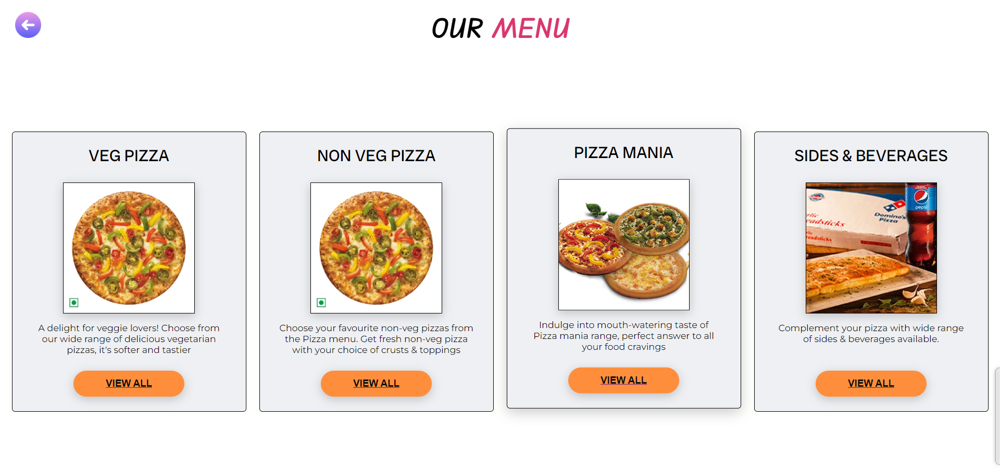
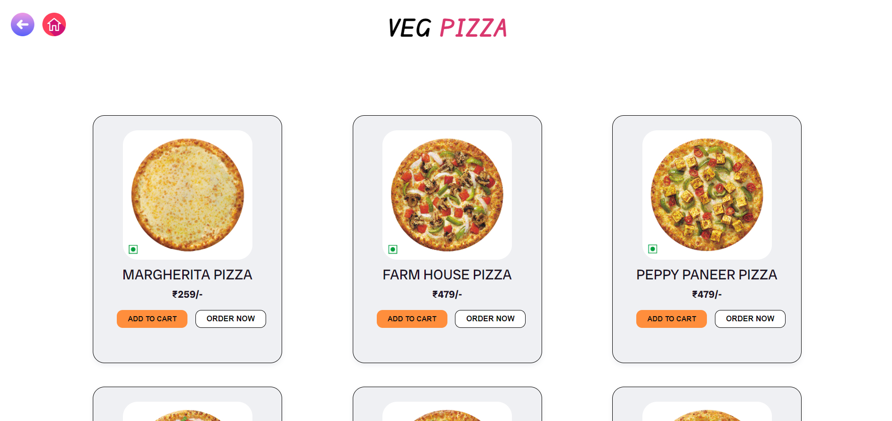
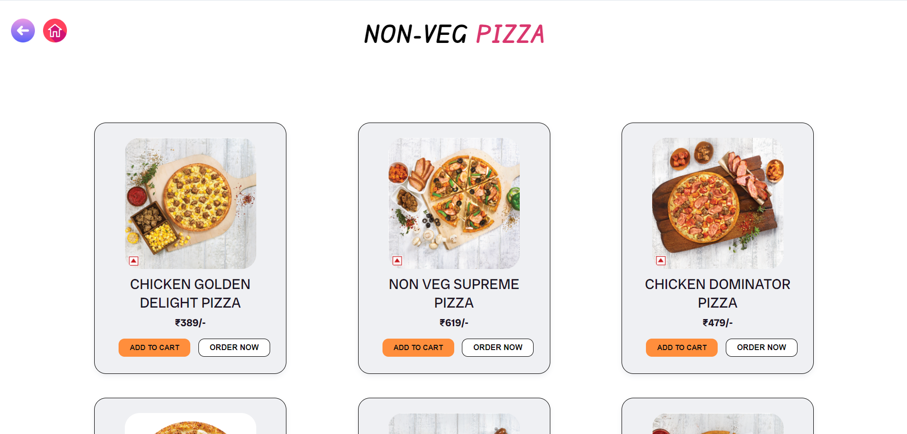
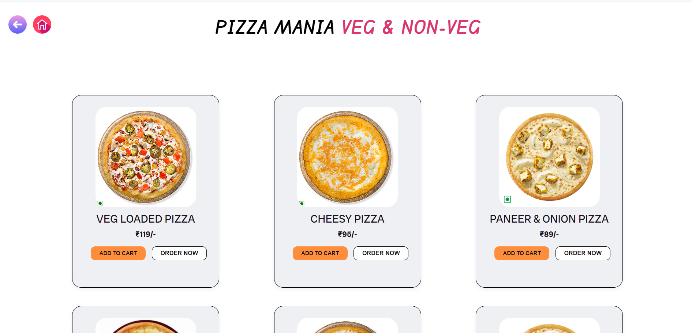
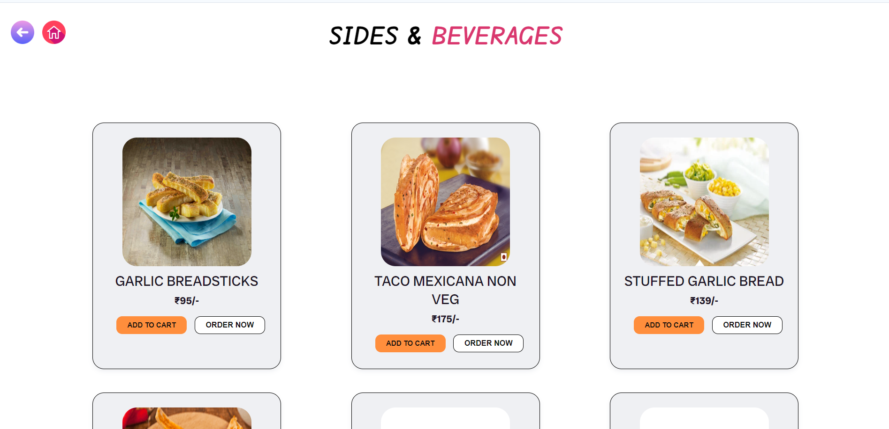
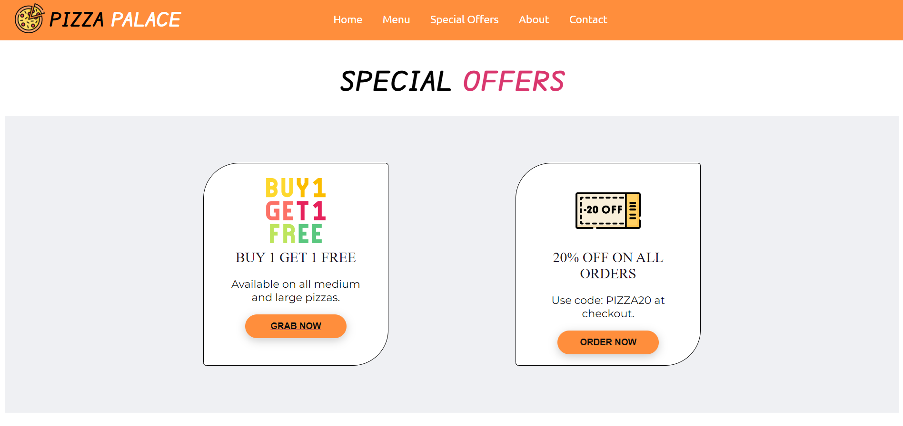
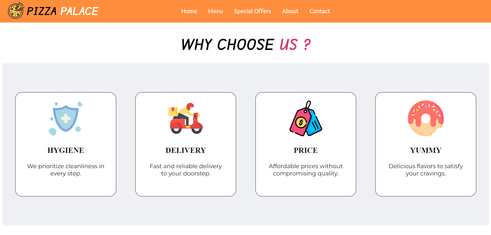
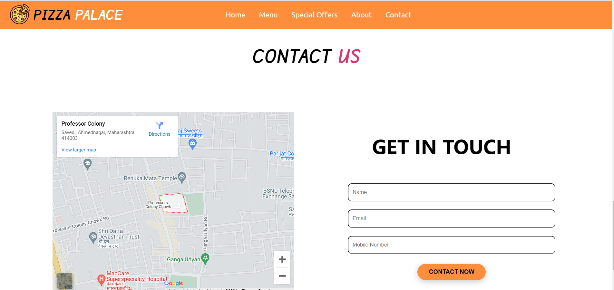
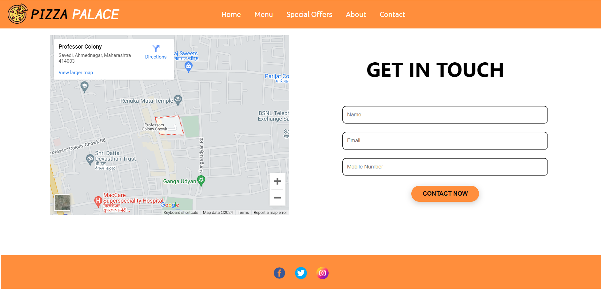

# Pizza Store Website

Welcome to the Pizza Store website, "Pizza Palace." This website showcases a variety of pizzas, special offers, and information about our services. It also provides contact information and links to our social media pages.

**Hosted Link:** [Pizza Palace Website](https://pizzapalacewebsite.netlify.app/)

## Screenshots

### Homepage

### MenuPage

### Veg-Menu 

### Non-Veg Menu  

### Pizza Mania Menu

### Sides & Beverages Menu

### Special Offers Section

### About Us Section

### Contact Section

### Footer

## Project Overview

The Pizza Store website is designed to provide customers with easy access to our menu, special offers, and information about our services. The website includes a homepage with navigation, an offer section, an about section, a contact form, and social media links.
